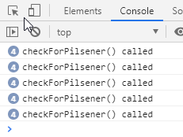

# never bind a function in a template
As the only one [@Michael_Hladky](https://twitter.com/Michael_Hladky) told me to 'never bind a function in a template' here is a repo to demonstrate the issue

# demo
See it in action on [firebaseapp](https://neverbindafunctioninatemplate.firebaseapp.com)

Be sure to open the debug console in your browser

# problem description

when you are binding a function in a template you may not be aware of *how often the binding is executed*.

this project tries to clarify the problem and show some solutions
